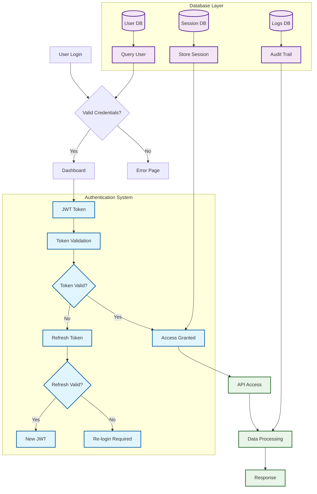
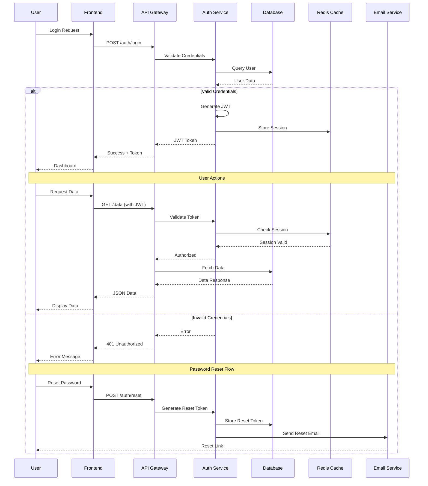
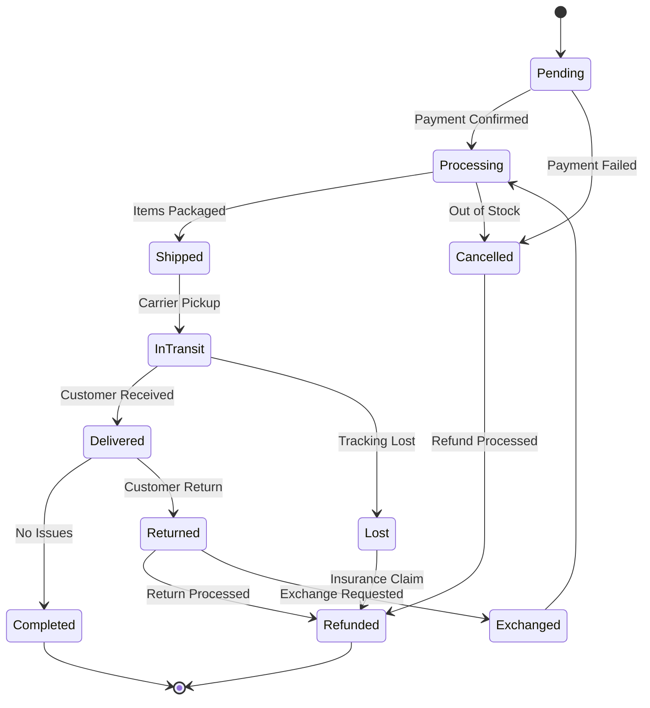
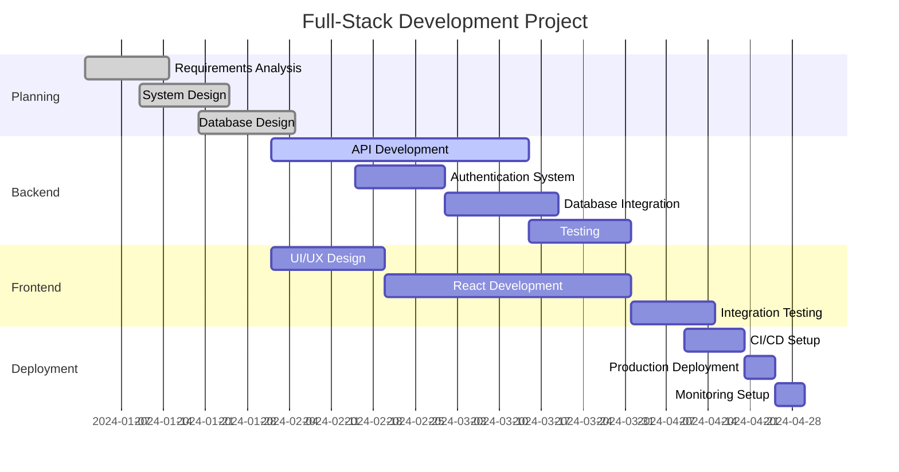
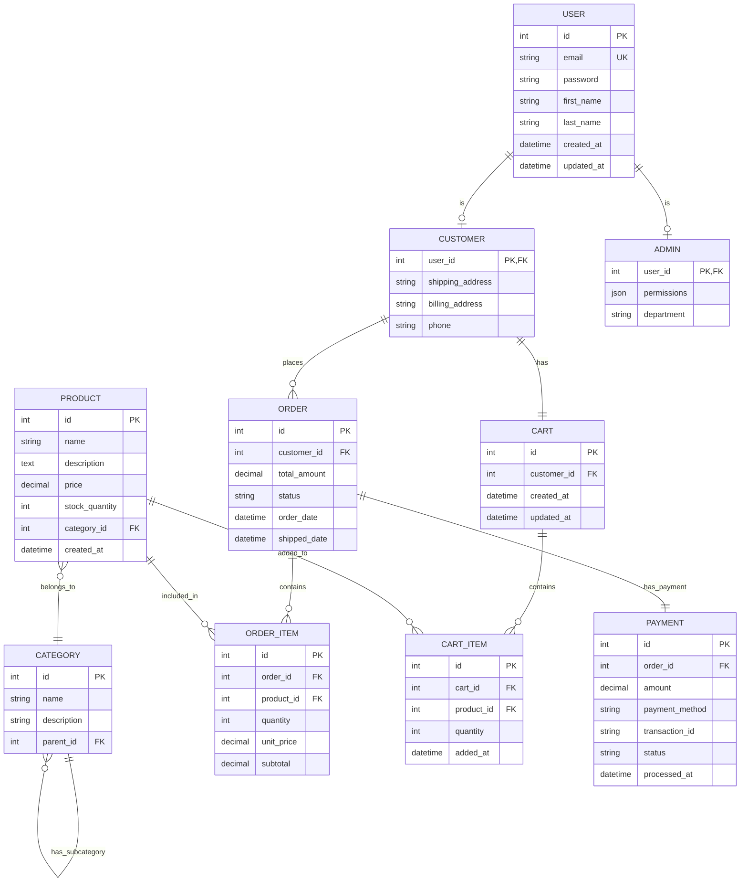
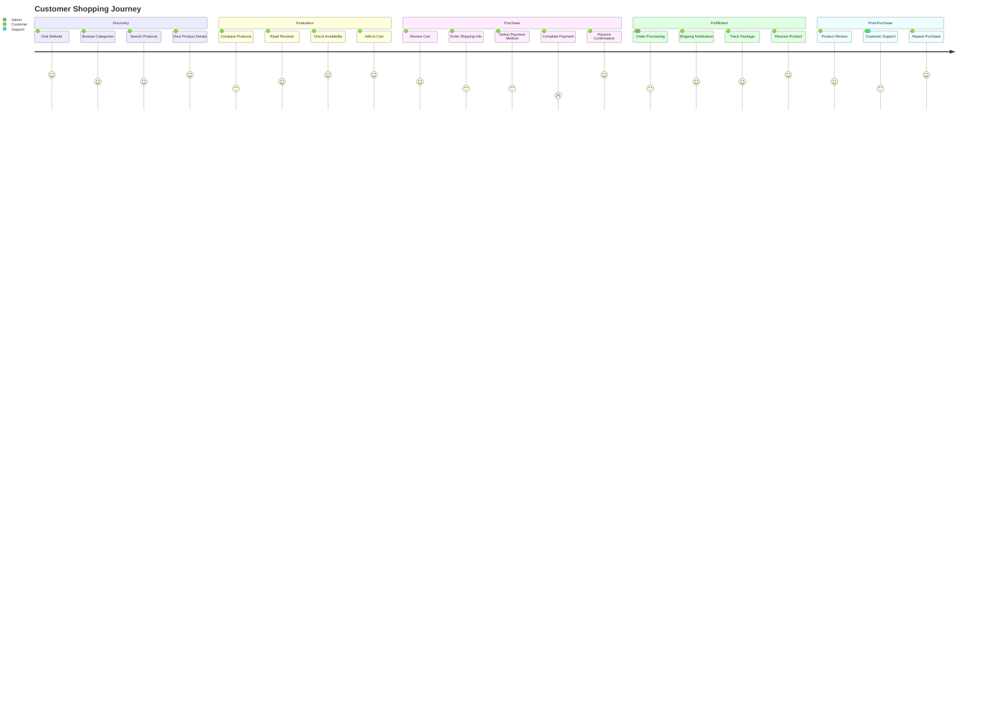

# Comprehensive Mermaid Diagram Examples

## 1. Complex Flowchart with Subgraphs and Styling



## 2. Sequence Diagram - Full-Stack Application Flow



## 3. Class Diagram - E-commerce System

```mermaid
classDiagram
    class User {
        +int id
        +string email
        +string password
        +string firstName
        +string lastName
        +Date createdAt
        +login()
        +logout()
        +updateProfile()
    }
    
    class Customer {
        +string shippingAddress
        +string billingAddress
        +placeOrder()
        +viewOrderHistory()
    }
    
    class Admin {
        +string permissions
        +manageProducts()
        +viewAnalytics()
        +manageUsers()
    }
    
    class Product {
        +int id
        +string name
        +string description
        +decimal price
        +int stock
        +string category
        +updateStock()
        +setPrice()
    }
    
    class Order {
        +int id
        +Date orderDate
        +decimal totalAmount
        +string status
        +calculateTotal()
        +updateStatus()
    }
    
    class OrderItem {
        +int quantity
        +decimal unitPrice
        +decimal subtotal
        +calculateSubtotal()
    }
    
    class Cart {
        +int id
        +Date createdAt
        +addItem()
        +removeItem()
        +clearCart()
        +getTotal()
    }
    
    class Payment {
        +int id
        +decimal amount
        +string method
        +string status
        +Date processedAt
        +processPayment()
        +refund()
    }
    
    User <|-- Customer
    User <|-- Admin
    Customer ||--o{ Order : places
    Order ||--o{ OrderItem : contains
    Product ||--o{ OrderItem : included_in
    Customer ||--|| Cart : has
    Cart ||--o{ Product : contains
    Order ||--|| Payment : has_payment
```

## 4. State Diagram - Order Processing



## 5. Gantt Chart - Project Timeline



## 6. ER Diagram - Database Schema



## 7. Journey Map - User Experience



## 8. Git Flow Diagram

```mermaid
gitgraph
    commit id: "Initial commit"
    branch develop
    checkout develop
    commit id: "Setup project structure"
    
    branch feature/authentication
    checkout feature/authentication
    commit id: "Add login component"
    commit id: "Add JWT handling"
    commit id: "Add logout functionality"
    
    checkout develop
    merge feature/authentication
    commit id: "Merge auth feature"
    
    branch feature/product-catalog
    checkout feature/product-catalog
    commit id: "Add product listing"
    commit id: "Add product search"
    
    checkout develop
    branch hotfix/security-patch
    checkout hotfix/security-patch
    commit id: "Fix security vulnerability"
    
    checkout main
    merge hotfix/security-patch
    tag: "v1.0.1"
    
    checkout develop
    merge hotfix/security-patch
    merge feature/product-catalog
    
    branch release/v1.1.0
    checkout release/v1.1.0
    commit id: "Version bump"
    commit id: "Update documentation"
    
    checkout main
    merge release/v1.1.0
    tag: "v1.1.0"
    
    checkout develop
    merge release/v1.1.0
```
```
